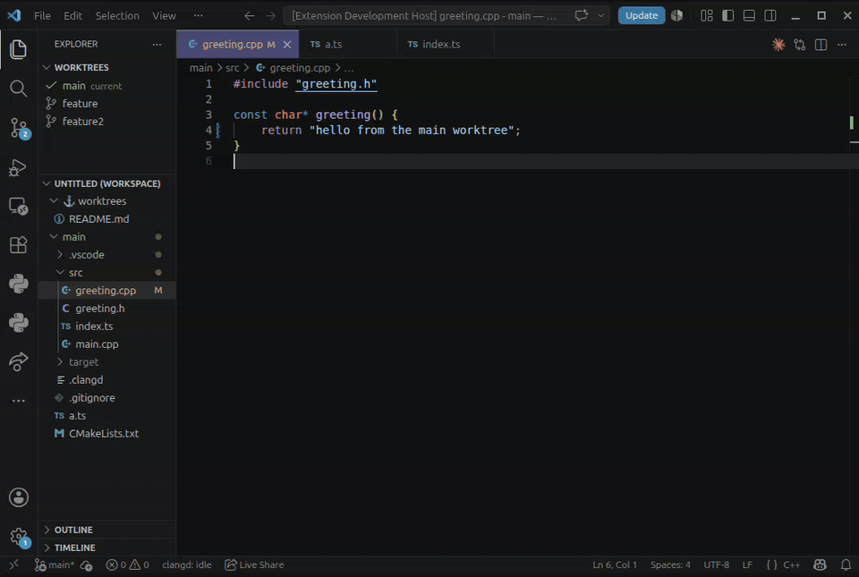

# Worktree Continuity

Switch between git worktrees seamlessly. Open file tabs automatically switch to
their worktree versions and back based on your selection (tabs with unsaved changes are
never touched). Language servers like clangd are automatically re-scoped to the
worktree you select. **No window reopen is performed** when switching, meaning your
AI agents are not interrupted.

This extension helps human users oversee AI agents working in worktrees.



## Recommended Layout

Drag your Worktrees pane above your Explorer pane as shown above.

## Language Servers

Language servers are extensions that power convenient features like "Go to definition".
When you switch worktrees, these servers are restarted. Without this, those features
can incorrectly take you across worktree boundaries.

The extension has been hard-coded with popular language servers for the most
common programming languages. See [Language Servers](docs/language-servers.md)
for the list of supported servers and configuration guidance.

If your language server does not appear on that list, you will need to add it via config. The
above link contains instructions.

## Development

```sh
npm install
npm test          # vitest unit tests (pure logic: tabmap, positionCache, worktrees, git)
npm run check-types
npm run lint
npm run compile   # or: node esbuild.js --production
```

## Attribution

The git worktree discovery and porcelain-parsing plumbing (`src/git.ts` and the
discovery helpers in `src/extension.ts` / `src/worktrees.ts`) is derived from
[tmokmss/vscode-git-worktree-switcher](https://github.com/tmokmss/vscode-git-worktree-switcher)
(MIT). The multi-root switch, tab-carry, position cache, and view are new.

## License

Distributed under the MIT License. Use, modify, and share freely!
